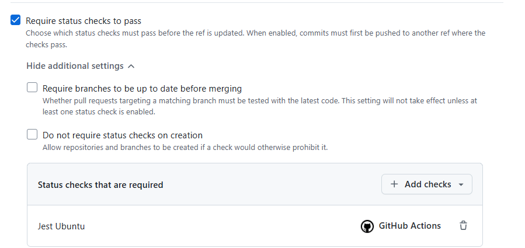

# Dia 31

## Primeira Pista lenta

### Criar processo de CI com GitHub Actions.

1. Criar nova branch chamada `actions`
2. Criar pasta de workflows: `.github/workflows`
3. Criar workflow `tests.yaml`

**Workflow de Tests**

```yaml
name: Automated Tests

on: pull_request

jobs:
  jest:
    name: Jest Ubuntu
    runs-on: ubuntu-latest

    steps:
      - uses: actions/checkout@v4

      - uses: actions/setup-node@v4
        with:
          node-version: "lts/hydrogen"

      - run: npm ci

      - run: npm test
```

#### Configurar Regra de permitir merge apenas quando a action de teste der sucesso

1. No `settings` do repositório > Rules > RuleSets.
2. Nome da Ruleset: `Branch main` > `Active`
3. Em `target` branch, add `branch default`.
4. Em **branch roles**, selecionar `Require a pull request before merging`
5. Em **branch roles**, selecionar `Require status checks to pass` (obrigado que a verificação de status passem)
6. Em `Require status checks to pass` + **Add checks** > Adicionar nome do Job, no caso: `Jest Ubuntu`
7. `Create` (Criar conjunto de regras)
   [regra criada](https://github.com/alx0594/clone-tabnews/settings/rules/5372543)

**Check Status**  


**Enquanto estiver com falhar, botão de merge desabilitado**


#### Dicas

**Qual a diferença entre `npm ci` e `npm install`**

**npm install:** Resolve, re-calcula as dependências encontradas no `package.json` (Irá devolver resultados diferentes se houver pacotes atualizados ao longo do caminho)
**npm ci:** Irá usar exatamente as dependências descritas no `package-lock.json` (Sempre irá devolver o mesmo resultado ao longo do tempo). Dessa forma, torna-se importante fazer o commit do `package-lock.json`

**Executando comando git de uma só vez**

`git add -A && git commit --amend --no-edit && git push -f`

## Segunda Pista Lenta.

### Criar Worflow para o Lint

1. Criar branch `lint-format-action`
2. Criar workflow: `linting.yaml`
3. No `package.json`, alterar o nome do script de lint para: `lint:prettier:check` e `lint:prettier:fix`

**Workflow de Lint**

```yaml
name: Linting Tests

on: pull_request

jobs:
  prettier:
    name: Prettier
    runs-on: ubuntu-latest

    steps:
      - uses: actions/checkout@v4

      - uses: actions/setup-node@v4
        with:
          node-version: "lts/hydrogen"

      - run: npm ci

      - run: npm run lint:prettier:check
```

#### Dicas

**pré-formatador de estilização:** Editor Config (.editorconfig)
**pós-formatador de estilização:** Prettier (Estilização após salvar o arquivo com o código)
**pós-formatador de qualidade:** ESLint.
