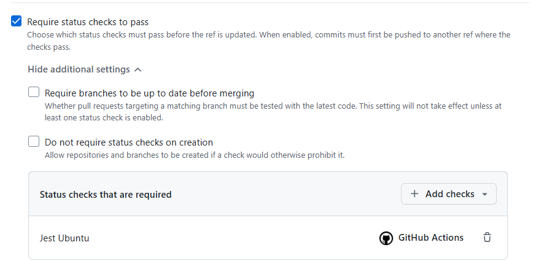
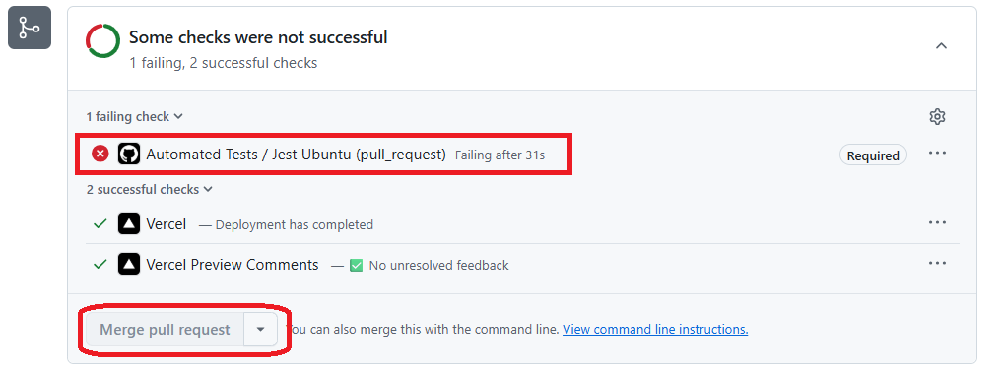
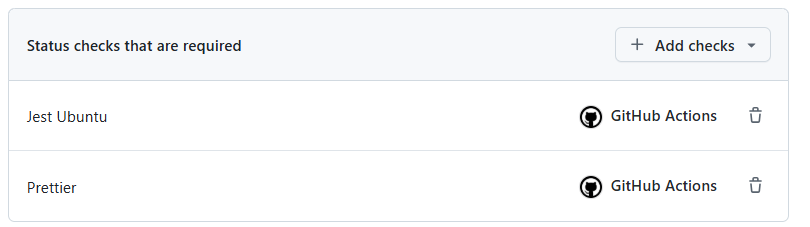

# Dia 31

## Primeira Pista lenta

### Criar processo de CI com GitHub Actions.

1. Criar nova branch chamada `actions`
2. Criar pasta de workflows: `.github/workflows`
3. Criar workflow `tests.yaml`

**Workflow de Tests**

```yaml
name: Automated Tests

on: pull_request

jobs:
  jest:
    name: Jest Ubuntu
    runs-on: ubuntu-latest

    steps:
      - uses: actions/checkout@v4

      - uses: actions/setup-node@v4
        with:
          node-version: "lts/hydrogen"

      - run: npm ci

      - run: npm test
```

#### Configurar Regra de permitir merge apenas quando a action de teste der sucesso

1. No `settings` do repositório > Rules > RuleSets.
2. Nome da Ruleset: `Branch main` > `Active`
3. Em `target` branch, add `branch default`.
4. Em **branch roles**, selecionar `Require a pull request before merging`
5. Em **branch roles**, selecionar `Require status checks to pass` (obrigado que a verificação de status passem)
6. Em `Require status checks to pass` + **Add checks** > Adicionar nome do Job, no caso: `Jest Ubuntu`
7. `Create` (Criar conjunto de regras)
   [regra criada](https://github.com/alx0594/clone-tabnews/settings/rules/5372543)

**Check Status**  


**Enquanto estiver com falhar, botão de merge desabilitado**



#### Dicas

**Qual a diferença entre `npm ci` e `npm install`**

**npm install:** Resolve, re-calcula as dependências encontradas no `package.json` (Irá devolver resultados diferentes se houver pacotes atualizados ao longo do caminho)
**npm ci:** Irá usar exatamente as dependências descritas no `package-lock.json` (Sempre irá devolver o mesmo resultado ao longo do tempo). Dessa forma, torna-se importante fazer o commit do `package-lock.json`

**Executando comando git de uma só vez**

`git add -A && git commit --amend --no-edit && git push -f`

## Segunda Pista Lenta.

### Criar Worflow para o Lint

1. Criar branch `lint-format-action`
2. Criar workflow: `linting.yaml`
3. No `package.json`, alterar o nome do script de lint para: `lint:prettier:check` e `lint:prettier:fix`

**Workflow de Lint**

```yaml
name: Linting Tests

on: pull_request

jobs:
  prettier:
    name: Prettier
    runs-on: ubuntu-latest

    steps:
      - uses: actions/checkout@v4

      - uses: actions/setup-node@v4
        with:
          node-version: "lts/hydrogen"

      - run: npm ci

      - run: npm run lint:prettier:check
```

### Branch Protection para o Prettier

1. Settings > Rules > Rulesets
2. Entrar na Rulset que já temos para branch main.
3. Em `Require status checks to pass` adicionar Job: `Prettier`.
4. `Save changes`



> Na aba de checks da Pull Request tem todos os checkes que a Pull Request passou. Exemplo: `https://github.com/alx0594/clone-tabnews/pull/18/checks`

#### Dicas

#### Formatadores

**pré-formatador de estilização:** Editor Config (.editorconfig)
**pós-formatador de estilização:** Prettier (Estilização após salvar o arquivo com o código)
**pós-formatador de qualidade:** ESLint.

##### Comando para mudar só a data do commit

`git commit --amend --date=now`

## Terceira Pista Lenta.

### Configurando ESLint

**ESLint:** encontra e conserta problemas no código JavaScript.
[ESLint](https://eslint.org/docs/latest/rules)

**ESLint Integração com NEXT.js**
[NextJS e ESLint](https://nextjs.org/docs/pages/api-reference/config/eslint)
Facilita e abstrai o uso do ESLint.

1. Criar nova branch `git checkout -b lint-quality-cations`
2. Adicionar script para `ESLint` no **package.json** `"lint:eslint:check": "next lint --dir .",`
3. Executar lint: `npm run lint:eslint:check`
4. Após execução, rodando de forma **scritch**, o arquivo `.eslintrc.json` foi criado de forma automática.
5. No arquivo `.eslintrc.json` adicionar `eslint:recommended` em `extends`, criando um array nesse parâmetro:
   `"extends": ["eslint:recommended", "next/core-web-vitals"]`

   **eslint:recommended** de acordo com a documentação, ativa as regras que o ESLint recomenda que todos usem para evitar possíveis erros.

   **eslint:all** de acordo com a [documentação](https://eslint.org/docs/latest/use/configure/configuration-files#using-predefined-configurations), habilita todas as regras fornecidas com ESLint **não é recomendado para uso em produção.**

**Para o ESLint entender como o Jest funciona, vamos precisar instalar a lib `eslint-plugin-jest`**

1. `npm install -D eslint-plugin-jest@28.6.0`
2. configurar `eslintrc.json`

   ```
   {
   "extends": [
    "eslint:recommended",
    "plugin:jest/recommended",
    "next/core-web-vitals"
   ]
   }
   ```

3. Agora executando o comando: `npm run lint:eslint:check` não teremos mais apontamentos relacionados a forma como o Jest trabalha com seus componentes, onde conseguimos usar sem imports específicos.

4. Para que não acha conflitos com o prettier, instalar: `npm i -D eslint-config-prettier@9.1.0`

5. Adicionar prettier na lista do `extends`

   ```
   {
   "extends": [
    "eslint:recommended",
    "plugin:jest/recommended",
    "next/core-web-vitals",
    "prettier"
   ]
   }
   ```

6. Nas Rulsets, adicionar Job Eslint como obrigatório na checagem de status.

### Iniciar correções apontadas pelo ESLINT

```
./infra/database.js
31:1  Warning: Assign object to a variable before exporting as module default  import/no-anonymous-default-export

./infra/migrations/1746050980513_test-migrations.js
5:15  Error: 'pgm' is defined but never used.  no-unused-vars
7:17  Error: 'pgm' is defined but never used.  no-unused-vars

./infra/scripts/wait-for-postgres.js
7:40  Error: 'stderr' is defined but never used.  no-unused-vars

./pages/api/v1/status/index.js
4:7  Error: 'variavelEsquecida' is defined but never used.  no-unused-vars

./tests/orchestrator.js
22:1  Warning: Assign object to a variable before exporting as module default  import/no-anonymous-default-export

info  - Need to disable some ESLint rules? Learn more here: https://nextjs.org/docs/basic-features/eslint#disabling-rules
```

1. Corrigindo `infra/database`
   **Adicionar as funções em uma variável e só depois exportá-la.**

   ```javascript
   const database = {
     query,
     getNewClient,
   };

   export default database;
   ```

2. Corrigindo `/tests/orchestrator.js`

```javascript
const orchestrator = {
  waitForAllServices,
};

export default orchestrator;
```

3. Corrigindo apontamentos dos arquivos de migrations (que futuramente serão excluídos)

   - Basta clicar na lâmpada que aprece ao passar o mouse no apontamento e clicar na opção de igonrar os apontamentos. Será adicionados comentários conforme abaixo:

   ```
   /* eslint-disable camelcase */
   /* eslint-disable  no-unused-vars */
   ```

4. Ao executar o comando `npm run lint:eslint:check` agora deverá retornar: **✔ No ESLint warnings or errors**

### Código

**Workflow com os lintings**

name: Linting Tests

on: pull_request

jobs:
prettier:
name: Prettier
runs-on: ubuntu-latest

    steps:
      - uses: actions/checkout@v4

      - uses: actions/setup-node@v4
        with:
          node-version: "lts/hydrogen"

      - run: npm ci

      - run: npm run lint:prettier:check

eslint:
name: Eslint
runs-on: ubuntu-latest

    steps:
      - uses: actions/checkout@v4

      - uses: actions/setup-node@v4
        with:
          node-version: "lts/hydrogen"

      - run: npm ci

      - run: npm run lint:eslint:check

### Dicas

#### Instalar ESLint no VSCode

1. Em extensões do VSCode, bucar por ESLINT (extensão da Microsoft).

#### Apontamento ESLint:

```
next lint
Invalid Options:
- Unknown options: useEslintrc, extensions, resolvePluginsRelativeTo, rulePaths, ignorePath, reportUnusedDisableDirectives
- 'extensions' has been removed.
- 'resolvePluginsRelativeTo' has been removed.
- 'ignorePath' has been removed.
- 'rulePaths' has been removed. Please define your rules using plugins.
- 'reportUnusedDisableDirectives' has been removed. Please use the 'overrideConfig.linterOptions.reportUnusedDisableDirectives' option instead.
```

**Correção**  
Erro de compartibilidade das versões instaladas automaticamente pelo Next, então rodar o comando:

1. `npm install eslint@8.57.0 eslint-config-next@14.2.4`

2. Instalar `ESLint` pelos módulos do VSCode.

3. Rodar: `npm i -D eslint-plugin-jest@28.6.0`

4. Rodar:` npm i -D eslint-config-prettier@9.1.0`

5. Rodar: git commit -m 'adds `lint:eslint:check` script with `ESLint`'

6. **Corrigir os erros/apontamentos encontrados pelo ESLint**

7. Rodar: git commit -m 'fix `eslint` linting'

# Dia 32

## Primeira Pista Lenta

- https://x.com/levelsio

- https://github.com/levelsio

## Segunda Pista Lenta.

### Guia de commits (The Linux Kernel)

- [The Kernel Linux](https://www.kernel.org/doc/html/v4.10/process/submitting-patches.html)

- Tópico 3, como separar as alterações. Podemos entender patch, como commit. Logo, temos:  
  **_Separe cada alteração lógica em um patch separado._**

  > Cada commit precisa ser justificável por seus próprios méritos

  Isto é, uma alteração precisa ter início, meio e fim.

- Pensamento ao se fazer commit:  
  Se for necessário desfazer um commit, quais seriam os impactos?

  > Por exemplo, precisei corrigir um erro ortográfico na página Home do projeto: a palavra "menas" estava escrita incorretamente. Durante a correção, percebi que também poderia ajustar a forma como a lista de alunos era carregada. Realizei o commit e enviei as alterações para produção.
  > No entanto, logo depois, alunos começaram a relatar que a lista de alunos não estava sendo carregada corretamente. Diante disso, foi necessário realizar um rollback para corrigir esse problema. Após a correção, fiz um novo commit e enviei o código para produção novamente. Porém, como o rollback desfez as alterações anteriores, a correção da palavra "menas" não foi incluída nesse último commit.
  > Esse cenário demonstra a importância de separar alterações distintas em commits diferentes, garantindo que ajustes menores, como correções ortográficas, não sejam perdidos ao lidar com problemas mais complexos.

- O que é uma mudança lógica?

  > Na programação, uma mudança lógica pode envolver a modificação de um algoritmo ou estrutura de código para melhorar sua eficiência ou corrigir erros, sem alterar sua funcionalidade principal.

## Terceira Pista Lenta.

- Qual deve ser o tempo verbal de um commit?  
  R: **Tempo verbal: Imperativo**. Exemplo: _Ajusta o bug de cadastro no backend"_; _"Adiciona um botão maior na interface"_

- **Conventional Commits**: https://www.conventionalcommits.org/en/v1.0.0/

# Dia 33

## Primeira Pista Lenta

1. Configurar [commitlint](https://commitlint.js.org/)
2. Instalar módulo commitlint: `npm install @commitlint/cli@19.3.0`
3. Instalar módulo com as regras do **conventional commits**: `@commitlint/config-conventional@19.2.2`
4. Criar arquivo `commitlint.config.js` e descrever quais regras o commitlint deverá usar:

   ```javascript
   module.exports = {
     extends: ["@commitlint/config-conventional"],
   };
   ```

   - Exporta um objeto `{}`
   - `extends` a regra do conventitonal.

5. `npx` comando disponibilizado junto com `npm` com o foco de executar os módulos pela linha de comando. Por isso o `x` de **Execute**
6. Executar: `npx commitlint`, que retornará as regras com o padrão de uso.
7. No início das instruções é descrito `[input] reads from stdin if --edit, --env, --from and --to are omitted` que é lido um comando de entrada (input) para que seja gerado uma saída (output)
8. Por tanto, executando `echo "teste" | npx commitlint`. Ele reporta que há dois problemas com essa mensagem:

   ```
   $ echo "teste" | npx commitlint
   ⧗   input: teste
   ✖   subject may not be empty [subject-empty]
   ✖   type may not be empty [type-empty]

   ✖   found 2 problems, 0 warnings
   ⓘ   Get help: https://github.com/conventional-changelog/commitlint/#what-is-commitlint
   ```

9. Agora executando o comando adicionando o subject (mensagem) e o tipo permitido: `echo "feat: mensagem principal" | npx commitlint`

## Segunda Pista Lenta

**git rebase:** refazer a base!

Da branch em questão, por exemplo, `lint-commits`, executar: `git rebase main`. Ou seja, rebase da branch `main` na branch `lint-commits`

### Atualizar Workflow de Linting com commitlint

1. Na documentação do [commitlint](https://commitlint.js.org/), buscar pelo `run` que faz essa execução no GitHub.
2. `Em commitlint.js.org`, acessar `References` > `CI setup` e pegar `run` do workflow de exemplo:

   `run: npx commitlint --from ${{ github.event.pull_request.base.sha }} --to ${{ github.event.pull_request.head.sha }} --verbose`

   **O que o comando `npx commitlint` está fazendo?**  
   R: Está executando o comando de `commitlint` de tal commit (from) até tal commit (to). Essas informações são coletadas dos enventos de pull request injetados pelo próprio GitHub.

3. No workflow de Linting, configurar Commitlint

```yaml
commitlint:
  name: Commitlint
  runs-on: ubuntu-latest

  steps:
    - uses: actions/checkout@v4
      with:
        fetch-depth: 0 # Para baixar todos os commits. Por padrão a action só baixa o último commit.

    - uses: actions/setup-node@v4
      with:
        node-version: "lts/hydrogen"

    - run: npm ci

    - run: npx commitlint --from ${{ github.event.pull_request.base.sha }} --to ${{ github.event.pull_request.head.sha }} --verbose
```

4. Configurar rulset para não permitr aprovação do merge equanto o commitlint não for executado com sucesso.

**Ao executar o commitlint via workflow, o mesmo apontou as mensagens de commit que precisam de correção, e para corrigir, usaremos o `git rebase`**

1. Executar no modo `iteartivo` pasando um commit que será usado como base: `git rebase -i HEAD~4`, ou seja, usando 4 commits atrás como base (verificado usando `git log`).

2. Será aberto uma janela do VSCode com os commits. Alterar de `pick` para `reword` > Salvar arquivo e fechá-lo. Em seguida será aberto nova aba no VSCode, agora podendo alterar a mensagem de commit, alterando de `add commitlint` para `ci: add commitlint`
3. Após ajuste das mensagens de commit para o padrão conventional commits, o workflow executou o `commitlint` com sucesso

### Dicas

**Comparando commits**

`git diff HEAD~1 HEAD`, onde ~1 indica qual commit anterior queR comparar com o commit atual.  
`HEAD~1` (Um commit anterior) com `HEAD` (commit atual)

## Terceira Pista Lenta

### Hooks (Ganchos)

[Husky](https://typicode.github.io/husky/)

1. Instalar módulo husky como dependência de desenvolvimento: `npm install --save-dev husky@9.1.4`
2. Executar comando: `npx husky init`
3. Após executar o comando `npx husky init`, foi criado o script de `prepare` automaticamente no `package.json`: **"prepare": "husky"**
4. Agora, depois de instalar as dependências, o `npm` executará o script de `prepare` automaticamente.
5. Veja que agora no arquivo `.git/config` temos o `hookPath` apontando para `.husky`
6. Deletar o aquivo chamado `pre-commit` e criar um com os nossos hooks.
7. Em `.husky`, criar: `commit-msg`: Tudo que digitarmos neste arquivo será executado após a mensagem de commit.
8. No arquivo `commit-msg`, digitar o comando: `npx commitlint --edit $1`, onde `$1` será o caminho onde está a mensagem de commit.

**Testando commit no formato errado para ver o hook funcionando**  
`git commit -m "teste mensagem no formato errado"`

**Resultado**

```
$ git commit -m "teste de mensagem no formato errado"
⧗   input: teste de mensagem no formato errado
✖   subject may not be empty [subject-empty]
✖   type may not be empty [type-empty]

✖   found 2 problems, 0 warnings
ⓘ   Get help: https://github.com/conventional-changelog/commitlint/#what-is-commitlint

husky - commit-msg script failed (code 1)
```

**_Dessa forma evitamos de subir mensagens errada para o GitHub, que também será validada no Job do workflow de linting_**

> Agora fica uma questão, não foi possível decorar todos os types de commit (feat, ci, chore, etc) para saber qual type usar. Nesse sentido, a comunidade criou a lib `commitizen`

9. Instalar dependência `npm i -D commitizen@4.3.0`
10. Com base na documentação [commitizen](https://www.npmjs.com/package/commitizen), executar o comando para preparar o ambiente local:
    `npx commitizen init cz-conventional-changelog --save-dev --save-exact`

    Após execução do comando, a dependência foi instalada: `"cz-conventional-changelog": "^3.3.0",`
    e o config foi adicionado no **package.json**:

    ```json
    "config": {
    "commitizen": {
      "path": "./node_modules/cz-conventional-changelog"
    }
    }
    ```

11. No `package.json`, adicionar o script de commit chamando o `commitizen`: `"commit": "cz"`
12. Adicionar os arquivos alterados em `staging -> git add -A`
13. Executar o comando: `npm run commit`, que irá aprecer um combo do tipo de commit para selecionar.

**Observação:** Caso queira pular as configurações de hooks que fizemos, no comando git podemos adiconar a opção **--no-verify** ou somente **-n** ficando assim: `npm commit --no-verify` ou `npm commit -n`

### Desafio

Adicionar um lint que valida que dados sensíveis não estão sendo commitados em arquivos da aplicação.

# Dia 34

## Primeira Pista Lenta

1. No GitHub.com, adicionar arquivo de licença no repositório: `LICENCE`

## Segunda Pista Lenta

### Semântica de versionamento

Três números separados por pontos: **[major].[minor].[patch]**

**patch:** Não causa breaking change. Alteração que não deverá afetar quem a consome. Não motifica nenhuma interface existente ao ponto de se tornar incompatível

**minor:** Alteração que também não gera incompatibilidade, ou seja, não introduz nenhuma breaking change. Nada muda na integração que já existe.

**major:** Reponsável por informar quando uma alteração resulta em uma breaking change. Pode quebrar a interagração com quem a consome. Quebra de interface.

## Terceira Pista Lenta

1. Criar branch `maintenance` (manutenção)
2. Remover o operador `^` das dependências no `package.json`
3. Executar o `npm install` das versões travadas.
4. Verificar dependências desatualizadas `npm outdated` Retorna uma lista de dependências que possuem atualizações disponíveis.
5. Executar `npm audit` para verificar uma auditoria dos pacotes
6. Feito isso, faremos um commit, `git add -A` e `npm run commit`
7. Executar o comando `npx npm-check-updates -i` _A opção `a` marca e desmarca todas na lista_ e _A opção space seleciona um a um._
   > Sugestão: Iniciar atualizando `patch`, depois `minor` e por último `major`
8. Vamos começar autalizando o dotenv. Selecionar dotenv (space) e atualizar (enter). Deseja instalar? Sim (Y)
   > A fim de manter a compatilidade das dependências com a do instrutor, caso uma dependência não seja a mesma da aula, atualizar manualmente no package.json
9. Executar `npm run test`. Se tudo funcionando, executar `npm run commit`
10. Agora atualizar `eslint-config-next`, valida `npm run lint:eslint:check`, executar o amend `git add -A && git commit --amend --no-edit`
11. Fazer comparação nas alterações dos commits, especificamente do arquivo **pacakge.json** `git diff HEAD^1 HEAD package.json`

## Quarta Pista Lenta

### Atualizar as dependências

1. Executar `npx npm-check-updates -i` irá aparecer uma lista das dependências **versão atual** -> **versão atualizada**

   ```
   (*) @commitlint/cli                  ^19.3.0  →   ^19.8.1
   (*) @commitlint/config-conventional  ^19.2.2  →   ^19.8.1
   (*) commitizen                        ^4.3.0  →    ^4.3.1
   (*) concurrently                      ^8.2.2  →    ^9.1.2
   (*) dotenv                           ^16.4.4  →   ^16.5.0
   (*) dotenv-expand                    ^11.0.6  →   ^12.0.2
   (*) eslint                           ^8.57.0  →   ^9.27.0
   (*) eslint-config-next               ^14.2.4  →   ^15.3.2
   (*) eslint-config-prettier            ^9.1.0  →   ^10.1.5
   (*) eslint-plugin-jest               ^28.6.0  →  ^28.11.0
   (*) husky                             ^9.1.4  →    ^9.1.7
   (*) jest                             ^29.6.2  →   ^29.7.0
   ```

2. Após atualização das dependências e execução do comando `npm i` apontou várias incompatibilidades. Dessa forma, faremos um `git checkout -- package.json` para voltar as alterações realizadas pelo comando de atualização. Também podemos usar o comando para voltar alterações de todos arquivos: `git checkout -- .`

3. Agora vamos fazer por partes.

   - Tirar a seleção de todas as atualizações.
   - Atualizar dpendência do Next. Log em seguida executar os testes.
   - Funcionando, fazer o `amend` do commit: `git add -A && git commit --amend --no-edit`

#### Dicas

`Ctrl + r` e `Ctrl - r`: Aumenta e diminui fontes do VSCode.

**ERESOLVE**: Erro ao resolver dependencias (_Error Resolving_)

**Peer Dependency** (Dependência de Pares) - "Dependência compartilhada"
Exemplo de Peer Dependency do `react-dom`  
node_modules\react-dom\package.json

```
"peerDependencies": {
    "react": "^18.2.0"
  },
```

# Dia 35

## Primeira Pista Lenta

### Refatoração

1. No package.json, renomear o script de chamda `wait-for-postgres` para `services:wait:database` e movê-lo para perto dos scripts de `services`. Salvar e realizar commit `npm run commit` do tipo `refactor`.

2. No **package.json** alterar os scripts de `migration` para `migrations` (no plural) e movê-los para baixo dos scripts de `service`
