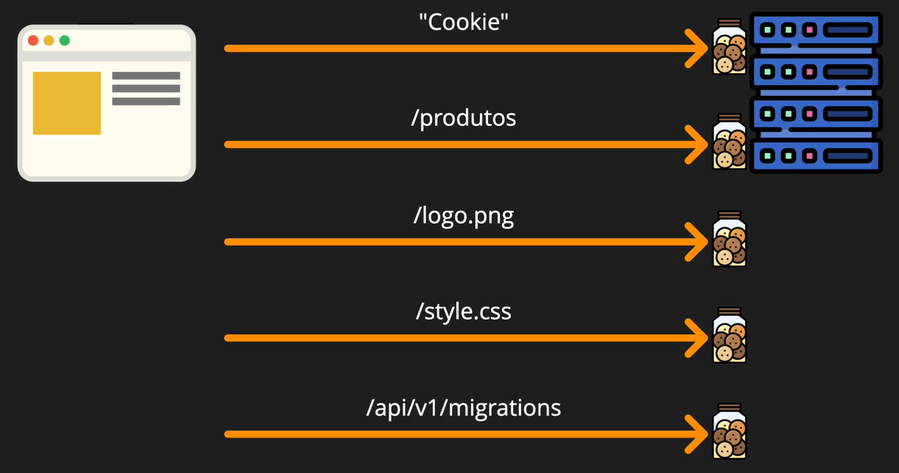
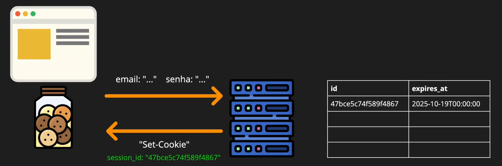
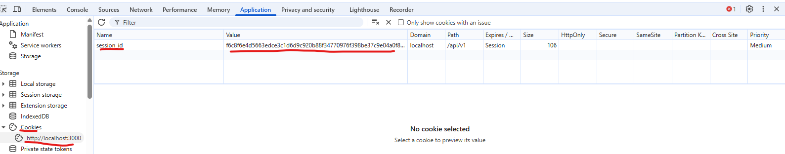

# Dia 41

## Primeira Pista Lenta

- Criar branch model-user
- Apagar migration de teste /infra/migrations/....teste-migrations
  `git rm infra/migrations/1746050980513_test-migrations.js`
- Estruturar testes integrados para migration de users. `tests\integration\api\v1\users\post.test.js`
- Por hora, criar migrations para users usando o npm: `npm run migrations:create create users`
- No arquivo de migrations user criado, criar tabela **users**
- Ajustar orchestrator para executar as migrations antes de iniciar os testes, visto que a base de dados é limpa a cada teste.

**Orchestrator**  

```javascript
async function runPendingMigrations() {
  await migrator.runPendingMigrations();
}
```

**post.test.js**

```javascript
import orchestrator from "tests/orchestrator.js";
import database from "infra/database";

beforeAll(async () => {
  await orchestrator.waitForAllServices();
  await orchestrator.clearDatabase();
  await orchestrator.runPendingMigrations();
});
```

**Tabela users**   

```javascript
/**
 * @type {import('node-pg-migrate').ColumnDefinitions | undefined}
 */
exports.shorthands = undefined;

/**
 * @param pgm {import('node-pg-migrate').MigrationBuilder}
 * @param run {() => void | undefined}
 * @returns {Promise<void> | void}
 */
exports.up = (pgm) => {
  pgm.createTable("users", {
    id: {
      type: "uuid",
      primaryKey: true,
      default: pgm.func("gen_random_uuid()"),
    },
    // Para referência, GitHub limita usernames para 39 caracteres
    username: {
      type: "varchar(30)",
      notNull: true,
      unique: true,
    },

    // Por que 254? https://stackoverflow.com/a/1199238
    email: {
      type: "varchar(254)",
      notNull: true,
      unique: true,
    },
    // Por que 72? https://security.stackexchange.com/q/39849
    password: {
      type: "varchar(72)",
      notNull: true,
    },

    // Timestamp com time zone: timestamptz
    // Sempre use timestamp com time zone: https://justatheory.com/2012/04/postgres-use-timestamptz/
    created_at: {
      type: "timestamptz",
      default: pgm.func("now()"),
    },

    updated_at: {
      type: "timestamptz",
      default: pgm.func("now()"),
    },
  });
};

exports.down = false;

```

**Testanto INSERT temporário pelo módulo de testes**  

```javascript
import orchestrator from "tests/orchestrator.js";
import database from "infra/database";

beforeAll(async () => {
  await orchestrator.waitForAllServices();
  await orchestrator.clearDatabase();
  await orchestrator.runPendingMigrations();
});

describe("POST /api/v1/users", () => {
  describe("Anonymous user", () => {
    test("With unique and valid data", async () => {
      await database.query({
        text: "INSERT INTO users (username, email, password, created_at, updated_at) VALUES ($1, $2, $3, $4, $5)",
        values: ["alexdesouza", "alex94tu@gmail.com", "senha123"],
      });
      const users = await database.query("SELECT * FROM users");

      console.log(users.rows);
      const response = await fetch("http://localhost:3000/api/v1/users", {
        method: "POST",
      });
      expect(response.status).toBe(201);
    });
  });
});

```

## Segunda Pista Lenta

### Rota

- Criar /api/v1/users/index.js

### Controller

### Model

### Testes Integrados

- Instalar dependência uuid, para trabalhar com o id da tabela user que está nesse formato.

- No teste post do user, importar `version` de `uuid`

### Dicas

**UUID** - Universally Unique Identifier (Identificador Único Universal)

**varchar** - Variable Character (Caracter variável)

**JSON.stringify({})** - Pega um objeto JavaScript e converte ele para uma string em Json.


# Dia 42

### Segunda pista lenta

`git rebase -i 7397ef542928b55a286a97ca86ff7c826636b6f7^`
Onde iremos fazer a refatoração da tabela User.
O `^` é usado para chegarmos no commit em questão. Ou poderiamos pegar o commit anterior. Teria o mesmo efeito. `git rebase -i 22564db01cc2170d17d3efdb6ea37d8440aea71f`

Por fim, `git commit --amend` e `git rebase --continue`

No Banco de dados Neon, foi necessário excluir a tabela pgmigrations para remover os testes de migração realizado anteriormente.

Projeto >> Editor SQL: DROP table pgmigrations. Tanto para stating quanto para production.

**REQBIN**

https://reqbin.com/

POST para:
https://clone-tabnews-git-model-user-alx0594s-projects.vercel.app/api/v1/migrations

Assim, será executada as migrations em staging

Criar usuário:
POST

https://clone-tabnews-git-model-user-alx0594s-projects.vercel.app/api/v1/users

{
  "username": "Alex",
  "email": "alex@gmail.com",
  "password": "senha123"
}


# Dia 43

### Primeira pista lenta

- Nunca assumir que o assunto segurança está tudo Ok.
- Nunca armazenar senha em texto puro.

O correto é não armazenar as senhas no banco de dados. Tá, mas como fazemos isso?

1. Usando Hash
crackstation.net (Quebra de hash de senhas comuns). Não usar senhas fracas!

2. Usando Hash + Salt
Ajudamos os usuários mesmo quando usam senhas fracas

- Bcrypt
Algoritmo usado para computar hash
Site para usar de exemplo: https://bcrypt-generator.com/

3. Usando Hash + Salt + Pepper
Além do sal (salt) também vamos apimentar (pepper) a senha do usuário.

- Pepper não deve ser salvo no banco de dados.
- O Pepper pode ser declarado em uma variável de ambiente.
- Senha + Pepper + Salt -> A partir disso é gerado o hash.

Exemplo:
No gerenciadores de senha, usado como plug-in do navegador, o bitwarden, por exemplo. Eles sempre geram uma senha de auto entropia, e quando adicionamos a essa senha, por exemplo, a letra A no início e a letra Z no final, é um tipo de pepper entre o bitwarden e o site que estou adicinando a senha.

# Dia 44

## Primeira pista lenta.

1. Criar model password.
2. Instalar dependência bcryptjs: `npm install bcryptjs@3.0.2`


## Segunda Pista Lenta

Método PUT ou Método Patch?
Por que existe do métodos para atualizar algo?
A diferença está na granularidade. 

Se a diferença está na granularidade. O correto então, quando formos atualizar o campo específico, devemos usar PATCH. Exemplo:

Se um usuário tiver: username, idade, email. E eu só quero atualizar o e-mail, o correto é usar o método HTTP PATCH.

- PATCH: Atualizar atributo específico.
- PUT: Sobrepoem o objeto anterior.

Se nos meus registros tenho o seguinte usuário:

```json
{
  "username": "alexdesouza",
  "email": "alex@gmail.com",
  "email2": "alex2@gmail.com",
}
```

E eu enviar uma requisição HTTP usando o método PUT apenas com usuário e email, o valor será sobreposto, ficando conforme abaixo:

```json
{
  "username": "alexdesouza",
  "email": "alex@gmail.com",
}
```

Por tanto, para atualização completa do objeto, usar PUT. 
Para apeans um campo específico, usar PATCH (Remendo).

### Usando testes de guerrilha

O teste de guerrilha é uma estratégia de construção do máximo de testes de falhas possíveis. Por exemplo, testar atualizar o usuário que não exite. Tentar atualizar um usuário que já existe para outro usuário, etc. Indo de cenário e cenário de erros.


### Regex Jest para teste específico:

npm run test:watch -- users/.username./patch

O ponto (.) em Regex significa qualquer caractere


### Closure

Nada mais é do que uma função dentro da outra.

async function create() {
  await userUniqueValidade();
  await emailUniqueValidade();

  async function userUniqueValidade(){};
  async function emailUniqueValidade(){};
}


### Usando Speread ... (Espalhar)

... spread. Espalhar o que tem dentro do objeto.
O que está na direita irá sobrescrever o que está na esquerda
const userWithNewValue = {...currentUser, ...userInputValues}

## Quarta Pista Lenta

### Gerando usuários automáticos para testes.

Regex para apenas teste de get: `npm run test:watch -- username./get`

Instalar Faker para geração de emails ou username: `npm install -E -D faker-js/faker@9.7.0`

Importar o faker no **orchestrator.js**
`import { faker } from @faker-js/facker`

E agora usar: `faker.internet.email(),`

O método createUser no módulo `orchestrator.js` deverá ficar conforme abaixo:

```javascript
  async function createUser(userObject) {
  return await user.create({
    username:
      userObject.username || faker.internet.username().replace(/[_.-]/g, ""), // # regex para subistituir _ . - da string username, que pode ser gerada pelo faker.
    email: userObject.email || faker.internet.email(),
    password: userObject.password || "validaPassword",
  });
}
```

Logo, nos meus testes que não diz respeito a insersão de usuário, não precisará mais realizar request de POST para adiconar usuário antes de testes de GET ou PATCH, por exemplo.

Exemplo módulo de teste:

```javascript
   test("With duplicated 'username'", async () => {
      await orchestrator.createUser({
        username: "user1",
      });
```

Regex para ajustar string de username gerada pelo faker
o `/g` significa que irá varrer a string de forma geral.

```javascript
userObject.username || faker.internet.username().replace(/[_.-]/g, ""), // # regex para subistituir _ . - da string username, que pode ser gerada pelo faker.
```

# Dia 45

## Primeira Pista Lenta

### Autenticação vs Autorização

Autenticação: Quem está se indentificando!
Autorização: O que o usuário pode fazer!

Exemplo: Sou Alex (Autenticação).
O que estou autorizado a fazer (Autorização)

### Autenticação

- **Cookie:** Com ele os navegadores em conjunto com os protocólos HTTP passaram a lembrar inforações. Por exemplo, o que havia deixado no carrinho de compra.

Cabeçalho HTTP: `Set-Cookie` "Colar uma espécie de post-it no navegador"

**Como funciona a dinâmica:**  
Ao realizar uma requisição de Login, o servidor responde com o "Set-Cookie" para o navegador salvar em seu banco de dados interno.

Login -> Set-Cookie


Requesições trafegando com cookie jar (Pote de biscoito), através do protocolo "Cookie". Limite de 4kb




- **Session-based Authentication**
Forma de criar sessão ao fazer login. Sessão ativa.

Tendo em vista que o cookie guarda as informações em texto puro, podendo haver fazamento de dados sensíveis, foi criado o Session-based Autentication, que funciona basicamente da seguinte maneira.

1. Navegador envia e-mail e senha para o servidor, que valida e autentica o usuário, e depois guarda em uma tabela temporária um id e a data de expiração da sessão. 
2. O servidor devolve ao navegador, para ser armazenado no Cookie Jar apenas o id da sessão, através do cabeçalho: `Set-Cookie`.

  


3. Posteriormente, sempre o usuário for acessar algo, será validado o ID e o tempo de expiração da sessão  

- Sucesso: 200  
- Sessão expirada: 401  

  


## Terceira Pista Lenta

**Exceções:**  

- modelNaoExiste.naoExiste()
- Adcionamos o instanceof justamente para nosso catch não entender toda exceção como NotFoudError
- Caso não seja NotFoundError, deixamos para quem saiba tratar


```javascript
async function getAuthenticateUser(providedEmail, providedPassword) {
  try {
    const storedUser = await findUserByEmail(providedEmail);
    await validatePassword(providedPassword, storedUser.password);
    return storedUser;
  } catch (error) {
    if (error instanceof UnauthorizedError) {
      throw new UnauthorizedError({
        message: "Dados de autenticação não conferem.",
        action: "Verifique se os dados enviados estão corretos.",
      });
    }
    }
    throw error;
  }
```

## Quarta Pista Lenta

- Cookie: "Texto" persistido do lado do cliente (Client-side)
- Sessão: "Texto" persistido do lado do servidor (Server-side)

Geralmente, o senso comum fala para guardar os dados da sessão no Redis. Mas precisa mesmo de um outro banco de dados para guardar sessão? Neste contexto, vamos usar o Postgres para guardar os dados da sessão também.

Depois, vale a pena usar o Redis...

Post GitHub não usa chave estrangeira nas tabelas: 
https://github.com/github/gh-ost/issues/331#issuecomment-266027731

https://www.shayon.dev/post/2023/355/do-you-really-need-foreign-keys/

- Node crypto para gerar token
  crypto fornece funcionalidades criptográficas em sequência de bytes randômicos.

  Exemplos dos bytes gerados em: `const token = crypto.randomBytes(48)`

  ```bash
  <Buffer cd 8b bf 6f 35 4f 3c 17 a6 e3 fe b9 b3 5f dc d6 18 04 6d b8 16 19 31 84 36 91 fe ac 8b 9d 7d 90 d6 63 63 12 ca c5 f7 2b 2d ef fc d5 f4 33 19 04>
  ```
  Buffer no JS é um pedaço de memória bruta. É algo mais cru que há antes da informação ficar legível para humanos.

  Não podemos, até porque não dá, para transitar o buffer dessa forma para os cookies. 

  Então precisamos tranformar esse buffer em caracteres de texto, ou seja, uma string que tenha caracteres seguros, que não vai quebrar um cookie.

  Por tanto, usaremos string no formato hexadecimal (sitema numérico que usa 16 símbolos), que usa caracteres que vai de: `0 a 9` e: `a até f`

  E para representar **1 byte** de buffer é necessário **2 caracteres** em hexadecimais, por tanto, `48 * 2 = 96.`


  ```javascript
  const token = crypto.randomBytes(48).toString("hex");
  ```


- Calculando 30 dias em milessegundos

```javascript
// Data de expiração em millessegundos
// 60s * 60m * 24h * 30d * 1000 milessegundos. 30 dias em milessegundos
const EXPIRATION_IN_MILLESECONDS = 60 * 60 * 24 * 30 * 1000; // 30 Days
```

Nos testes automatizados, para conseguirmos validar se a data de expiração está realmente a frente 30d em milessegundos, é necessário zerar os milessegundos antes, pois em momento de insersão dos valores na tabela do banco de dados, sempre haverá diferença. Por tanto, segue estratégia de verificação:

```javascript

 const expiresAt = new Date(responseBody.expires_at);
      const createdAt = new Date(responseBody.created_at);

      // Zerando millesegundos para conseguir validar se expiresAt está de fato a frente 30 dias em millesegundos
      // Necessário pelo fato de momento de insersão do usuário os millesegundos ser diferentes
      expiresAt.setMilliseconds(0);
      createdAt.setMilliseconds(0);

      expect(expiresAt - createdAt).toBe(session.EXPIRATION_IN_MILLESECONDS);
```

## Quinta Pista Lenta

As aspas usadas antes do objeto json `'{}'` são usadas para que possamos usar aspas comuns detro do objeto json sem precisar escapá-las com `/`

**Criando usuário**

```bash
curl -v -X POST http://localhost:3000/api/v1/users \
-H "Content-Type: application/json" \
-d '{"email": "cookie@gmail.com", "username": "cookie", "password": "cookie"}'

```

**Criando Sessão**
```bash
curl -v -X POST http://localhost:3000/api/v1/sessions \
-H "Content-Type: application/json" \
-d '{"email": "cookie@gmail.com", "password": "cookie"}'

```

Agora em nosso controller (sessions/index.js), adicionar o Cookie na sessão:

```javascript
response.setHeader("Set-Cookie", `session_id=${newSession.token}; Path=/`);
```

Agora fazendo pelo navegador, F12, aba console:

Dado que antes estavamos fazendo os testes usando o `curl` como client e ele não armazena cookies, pois ele não tem o cookies Jar, vamos fazer o mesmo teste usando o navegador.

Ao inspecionar o navegador, na aba console, executar o comando:  

```javascript
fetch('/api/v1/sessions', {method: 'POST', headers: {'Content-Type': 'application/json'}, body: JSON.stringify({email: 'cookie@gmail.com', password: 'cookie'}) })

```

Depois, para verificar o resultado, navegar até a aba Network (onde tem as requisições feitas pela rede). Agora pasta clicar na requisição que realizamos `sessions`

Clicando em sessions, conseguimos ver os dados de request, response e header; com isso, já podemos ver que o set-cookies está no header.

Por fim, na aba `Application` onde encontramos várias coisas sobre a ótica da pagina acessada, encontramos os quesitos de armazenagem (Local storage, Session storage) e inclusive os Cookies.  



Muito bem, agora que sabemos como segue a configuração do cookie, vamos usar uma lib para setar os atributos do cookie.

- Instalar dependência
   `npm install -E cookie@1.0.2`

- Setar atributos

  ```javascript
    const setCookie = cookie.serialize("session_id", newSession.token, {
    path: "/",
    maxAge: session.EXPIRATION_IN_MILLESECONDS / 1000, //convertendo milessegundos em segundos (/1000)
    secure: process.env.NODE_ENV === "production" ? true : false,
  });

  response.setHeader("Set-Cookie", setCookie);
  ```
- No console do navegador, digitar:
  `document.cookie` 
  Não tem problema o usuário dententor das credênciais ter acesso a esses dados. 

  O problema é quando um Hacker tem acesso a essas informações através de um ataque chamado **XSS - Cross-Site Scripting**, que nada mais é que injetar um código Javascript que realiza, por exemplo, um fetch para uma página dele enviando o cookie.

  Então, vamos configurar de forma que os cookies só sejam trafegados através do HTTP (HttpOnly), ou seja, só o navegador terá acesso e não o script que está em client-side.

- No console do navegador, digitar novamente:
  `document.cookie` 

  Portanto, já via script usando o console do navegador, não traz mais o cookie.

**Agora vamos fazer os testes automatizados, validando os cookies**

- Instalar a dependência: `npm install -E -D set-cookie-parser@2.7.1`

- No módulo de teste da sessão, capturar o header do response.

- Usar `map: true` pois o retorno do método setCookieParser é um array.

- Agora, basta validar o objeto session_id

```javascript

 const parsedSetCookie = setCookieParser(response, {
        map: true,
      });
      expect(parsedSetCookie.session_id).toEqual({
        name: "session_id",
        value: responseBody.token,
        maxAge: session.EXPIRATION_IN_MILLESECONDS / 1000,
        path: "/",
        httpOnly: true,
      });
```