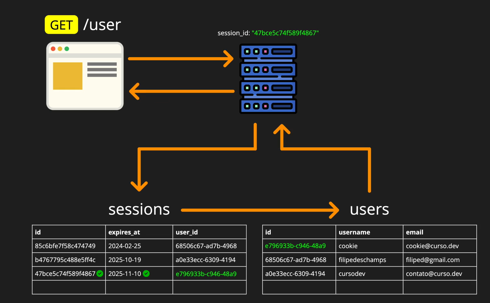

# Aula 46
## Primeira Pista Lenta

Regra de como iremos tratar os cookies do usuário através do endpoint `api/v1/user` (sim, no singular)  
E verificar que o usuário está "vivo" no sistema, e consultar seus dados pessoais.  

## Segunda Pista Lenta

1. Criar pasta de teste `user` com o teste `get.test.js`
2. Implementar o teste de `GET` ao endopoint `/api/v1/user`
3. Implementar a rota que irá receber essa requisição em `pages/user/api/v1/user/index.js`