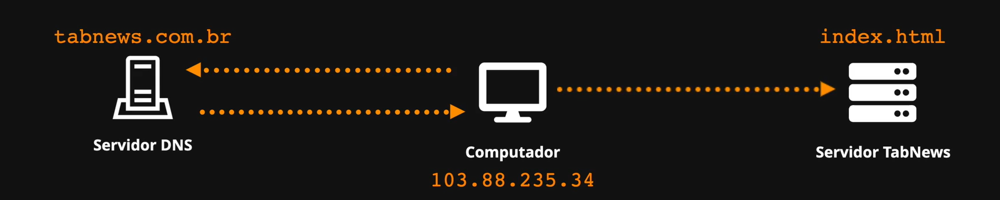
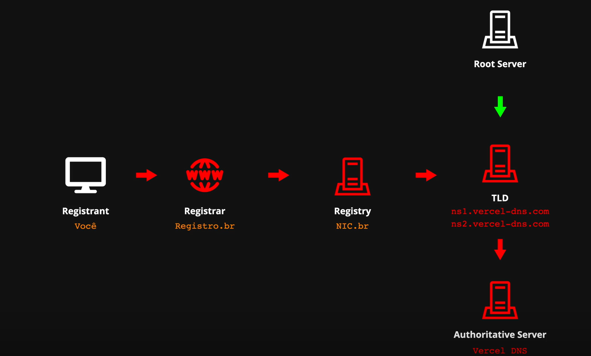
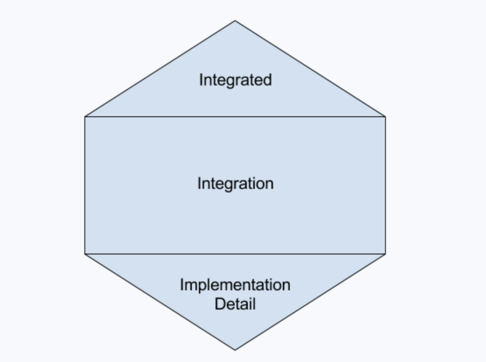

# Dia 2

## O que é Git e GitHub.

- Podemos comparar Git e GitHub com o Youtube:
  O arquivo .mp4 (local) seria por exemplo o repositório .git (local)
  O Youtube Hospeda Vídeo e o GitHub hospeda repositório.

# Dia 3

## Instalar nvm no windows

1. Acessar: https://github.com/coreybutler/nvm-windows/releases/tag/1.2.2
2. Baixar e executar: nvm-setup.exe
3. Instalar versão do nodejs: nvm install 18.14.2
4. Verificar versões nvm ls

- curiosidade .npmrc, .nvmrc, .bashrc, .vimrc; onde rc significa Run Commands, convensão de arquivos de inicialização.

## Criar arquivo de manifesto e dependências.

1. `npm init`, preencher apeans a licença como MIT.
2. `npm install next@13.1.6`
3. `npm install react-dom@18.2.0`

`react`
**Função Principal:** Biblioteca core do React. (cérebro)
**O que faz:** Fornece as funcionalidades funcamentais para criar componentes, manipular estados (`useState, useEffect`, etc) e lidar com o sistema de reativdade do React. Ele só cuida da lógica, estrutura e reatividade.
**Exemplo** `import React { useState } from 'react'`;

`react-dom`
**Função Principal:** Integra o React com o DOM do navegador. (mão)
**O que faz:** Permite renderizar os componentes React na página HTML. Ou seja, ele pega os componentes criados com react e insere no DOM real da aplicação
**Exemplo** `const root = ReactDOM.createRoot(document.getElementById('root'))`;
`root.render(<App />)`;

# Dia 4

## Protocolos

- Tipos de protocolos: HTTP, FTP, SMTP

## Executar aplição:

1. Criar script no package.json: "dev": "next dev"
2. `npm run dev`

- Next utiliza Roteamento Baseado em Arquivos

### Criando diretório de páginas

1. criar pasta **pages** Tudo que estiver dentro dela, o Next entederá como uma página, rota pública.
2. Criar um arquivo `index.js`, adicionando simplesmente um componente React:

```
function Home() {
    return <h1> Teste </h1>
}
export default Home
```

### Disponibilizar serviço na internet usando VSCODE

1. No terminal, clicar na função PORTS >> Port forward
2. Alterando visibilidade de Private para Public. Clicar com botão direito em Visibility >> Port Visibility >> Public
3. A URL poderá ser acessada de qualquer dispositivo: https://qr7jcj61-3000.brs.devtunnels.ms/

# Dia 5

## Onde fica o Git?

Git é um Sitema de controle de versão distribuído.

## Git Log

- ` git log`
- `git long --oneline`

## Git commit

### 3 Estágios:

0. Untracked (arquivos que ainda não estão sendo ratreados/gerenciados/desconhecido pelo git)
1. Modificado (modified)
2. Staged (Alterações que serão confirmadas, após adicionadas (add))
3. Commit (foto do estado atual, comprometimento, salvar alterações)

## Git Diff e Amend

- Emendar um commit amend...
- git diff
- `git commit --amend` (o git vai pegar o que está staged, ou seja, tudo que foi adicionado pelo comando add, e emendar em um commit anterior)

### Passos

1. `git log --oneline` (Pegar hash do commit): 4087ce5
2. Fazer alteração do arquivo desejado (modified)
3. Adicionar em staged (git add)
4. Emendar alteração com commit anterior: `git commit --amend`. (Pronto, alteração emendada com commit anterior)
5. git log --oneline (verificar hash do commit): b18996d -> O identificador do commit mudou! **Portanto, os commits são imultáveis.**

# Dia 6

## Git Push

- Olhando as alterações via `git status` o git enfatiza que a branch local está com um commit a frente da origin branch (branch remota):
  > **On branch main** Your branch is **ahead** of 'origin/main' **by 1 commit**. (use "git push" to publish your local commits)
- Agora verificando o `git status`, a mensagem do git é que a branch local está atualizada com a branch remota (origin)
  > Your branch **is up to date** with 'origin/main'.

# Dia 7

### Client x Server (Cliente x Servidor)

> Fazendo uma analogia a um restaurante, o cliente faz um pedido ao garçon (servidor) que retorna com o prato de comida solicitado pelo cliente.
> O grançon também faz o papel de cliente quando repassa o pedio para cozinheiro. Cliente -> Garnçon -> Cozinheiro.
> Cliente (Navegador) -> Server (Vercel, onde o site está hospedado) -> Server (Banco de dados)

### Deploy e hospedagem do site

1. Vercel: vercel.com
2. Para autenticação, usar GitHub. Lay Number
3. Importar repositório do GitHub (Import Git Repository) >> Import >> Deploy

# Dia 8

> Não desistir no meio do caminho. Ir até o final.
> Modelo Orgânico vs Modelo 3D. O modelo orgânico é uma boa opção!

# Dia 9

## Criando Milestones e Issues do Projeto

> O objetivo das Milestones e Iussues e conseguir quebrar grandes tarefas em tarefas menores e viáveis, de forma a engajar o cérebro no sentido de que está havendo progresso.

> Milestone e Issue possibilita ver o progresso da construção de uma aplicação de forma organizada. Entender o que foi feito e o que ainda precisa ser realizado.

1. No repositório, clicar em Issues, em seguida clicar em Milestone. Nome: Milestone 0: "Em Construção"
2. Clicar em Issues novamente, criar nova issues. Nome: "Configurar domínio .com.br", vincular a Issue a Milestone 0: "Em Construção"

# Dia 10

### Ligar sincronização do editor (codespaces):

1. No ínone de conta do VSCode, selecionar opção Settings Sync, em seguida logar em uma conta na nuvem, no caso no GitHub. Com isso, as configurações do ambiente/IDE ficarão salvas.

### Configurar EditorConfig

> Para configurar o código no formato certo, respeitando mesmos espaçamentos, distância entre linhas, etc.

1. Documentação: https://editorconfig.org/
2. Instalar o plug-in do editorconfig
3. Criar arquivo na raiz do projeto: `.editorconfig`.
4. No `.editorconfig` conseguimos especificar em quais pastas/diretórios do projeto as regras deverão ser aplicadas, no caso `root = true` para ser aplicado em todo o projeto.
5. No `.editorconfig` definir que as regras que deverá ser aplicadas em todos arquivos [*]
6. No `.editorconfig` padronizar identação: `indent_style = space` e `indent_size = 2`

### Configurar Pettier no package.json

1. Instalar Prettier: `npm install prettier -D` (-D para instalr como dependência de desenvolvimento)

2. Adicionar comando de checagem do prettier dentro do script do package.json:
   `"lint:check": "prettier --check ."` O ponto (.) faz com que seja verificado o diretório corrente como um todo.

3. Executando o comando: `npm run lint:check` (Irá conferir a formatação do código)

4. Adicionar comando dentro de scripts package.json que ajustará os arquivos:
   `"lint:fix": "prettier --write ."` (Escreverá nos arquivos para que fiquem devidamente estilizados)

5. Executar comando para ajustar os arquivos: `npm run lint:fix`

### Configurar Pettier na IDE VSCode

1. Instalar extensão Prettier
2. Configurar estilização do prettier com padrão da IDE:
   > Settings >> Settings >> Buscar por formatter
   > Em Default Formatter, selecionar Prettier

### Configurar Formatar ao Salvar (On Save) na IDE VSCode

1. Em Settings >> Settings, buscar por: format on save >> Selecionar checkbox.
   > Isso sempre formatará os arquivos assim que salvos.

### Adicionar arquivo .prettierignore

> Em casos de arquivos que não queremos interação do prettier, podemos adicionar o arquivo .prettierignore e adicionar arquivos ou pastas que devem ser ignorados (Ex.: .next)

# Dia 11

### DNS

> Domínios não passam de apelidos para os IP's.

> DNS - Domain Name System (Sistema de Nomes de Domínios)

> DNS aplido para traduzir para o IP final.

> Um exemplo seria os contatos telefônicos que temos, fica mais fácil vincular o nome do contato ao número de telefone, imagina se houvesse apenas o número, como saberiamos de quem ele é?

> Como funciona: Nosso dispositivo acesso o servidor de DNS, que por sua vez resolve o IP do DNS, retornando para o computador de volta, que ai sim, chama o site em questão:



- Desafio, descobrir o IP do domínio: curso.dev

  ping curso.dev -> 104.26.13.195

# Dia 12

## DNS Parte II

> Banco de dados TLD?

> Registro de um domínio pode ser realizado em: registro.br

> NIC.br: Registry (Responsável por armazenar todos os domínios .br e os respectivos IP's no Brasil)

> NIC - Núcleo de Informação e Coordenação do Ponto BR (nic.br)

> Verificar registro do DNS: whatsmydns.net

### Passos para registrar um DSN:

1. Entrar no site: registro.br
2. Realizar autenticação
3. Pesquisar por DNS ainda não cadastrado.
4. Solicitar cadastro do DNS.
5. Após confirmação, chegará e-mail para efetura pagamento do DNS.
6. Pronto DNS registrado. O domínio poderá ser consultado no site: whatsmydns.net (Pode levar algum tempo)

### Configurar o servidor de DNS:

- Com base na imagem, o fluxo completo para registrar um domínio e configurar um servidor de DNS segue os seguintes passos:
  
  1. Eu como registrante, registro um domínio em registro.br
  2. Registro.br disponibilizará o domínio no Registry NIC.br, onde tem todos os domínios .br
  3. O TLD, após configurado o DNS em registro.br, aponstará para os servidores da Vercel, que por sua vez será o servidor autoritativo.

### Passos para configurar o Servidor DNS

1. Acessar a Vercel, onde o site está hospedado, clicar em Domains.
2. Em Seguida, clicar em Add Existing Domain, selecionar aplicação, continue.
3. Digitar o domínio cadastrado em registro.br (alxtab.com.br)
4. Em Nameserver, copiar os nameservers
5. Acessar registro.br,acessar o domínio alxtab.com.br, em seguida clicar em alterar DNS Server
6. Adicionar os nameservers copiados da Vercel nos campos Servidor 1 e Servidor 2.
7. No site whatsmydns.net, verificar se os serversname foram atualizados (leva em torno de 2h).

### Servidor Autoritativo

> O Servidor Autoritativo, no nosso caso é o da Vercel, é quem sabe que com base no domínio, qual é o IP do servidor onde o site está hospedado.

- **dig:** ferramenta especializada em fazer request contra servidores de DNS
- Usando WSL, instalar o **dig** `sudo apt-get update` e `sudo apt-get install dnsutils`
- Executar o comando para verificar o DNS: `dig alxtab.com.br A`
- Executar o comando para verificar o DNS com a mensagem adicionada no servidor da Vercel: `dig alxtab.com.br TXT` (Tipo de Registro TXT)

# Dia 13

### Status dos serviços

- Vercel Status: https://www.vercel-status.com/
- GitHub Status: https://www.githubstatus.com/

# Dia 14

## Estrutura das pastas

### Sites para desenhar

- https://tree.nathanfriend.com/
- https://ascii-tree-generator.com/

### Desenho

```
📦 root
┣ 📂 pages
┃ ┗ 📜 index.js
┣ 📂 models
┃ ┣ 📜 user.js
┃ ┣ 📜 content.js
┃ ┗ 📜 password.js
┣ 📂 infra
┃ ┗ 📜 database.js
┃ ┣ 📂 migrations
┃ ┣ 📂 provisioning
┃ ┃ ┣ 📂 staging
┃ ┃ ┣ 📂 production
┣ 📂 tests
```

### Dicas de atalhos para desenhar estrutura das pastas

```
Raiz: :package: → 📦
Diretório fechado: :file_folder: → 📁
Diretório aberto: :open_file_folder: → 📂
Arquivo: :scroll: → 📜

Use o padrão :nome_do_emoji: nas Issues do GitHub que ele converte automaticamente.

Caracteres para desenhar a estrutura (usando Alt Codes):
Linha vertical: Alt + 179 → │
Ramificação: Alt + 195 → ├
Canto final: Alt + 192 → └
Estender linhas: Alt 196 → ─
```

# Dia 15

## Testes Automatizados

- **Teste Runner:** Código para testar outro código. Libs: (Jest, Mocha, Ava)
- **Teste Regressivo:** Valida com base em testes, se o sistema sofreu regressão. Isto é, se algo deixou de funcionar após alterações.

### Instalar Teste Runner Jest

- `npm install -D jest@29.6.2`

### Adicionar script de execução Jest no package.json

- `"test": "jest"`

- `npm run test`

- **Modo assistido:** `"test:watch": "jest --watchAll"`
- **Modo assistido Execução:** `npm run test:watch`

### Criando Teste de Teste

- Criar pasta **tests**
- Criar arquivo calculadora.test.js

### Primeiro Exemplo: Construção de testes

1. Precisamos usar a função test() do Jest, com dois parâmetros: **Nome do Teste** e uma **função de callback**

```
test("nome do teste", () => {
  console.log("Arrow");
});

test("testando outra condição do meu sistema", () => {
  console.log("Testando...");
});
```

### Segundo Exemplo: Agora Usando expect().toBe()

> Lado esquerdo, valor que foi gerado de forma dinâmica por parte do sistema.

> Lado direito, valor esperado (Hardcoded)

> Espera que algo vindo do sistema **_expect()_** tenha o seguinte valor **_toBe()_**

```
test("espero que 1 seja 1", () => {
expect(1).toBe(1); // Espera que 1 seja 1
});
```

```
test("espero que banana seja banana", () => {
expect("banana").toBe("banana"); // Espera que banana seja banana
});
```

### Terceiro Exemplo: Teste de Verdade!

1. Criar uma pasta chamada models, dentro dela adicionar o arquivo calculadora.js

```
function somar(arg1, arg2) {
  return arg1 + arg2;
}
exports.somar = somar; // Forma de exportar módulos usando CommonsJS
```

2. Importar funcionalidade importar no arquivo de testes automatizados calculadora.test.js

```
const calculadora = require("../models/calculadora.js");

test("somar 2 + 2 deveria retornar 4", () => {
  const resultado = calculadora.somar(2, 2);
  expect(resultado).toBe(4);
});
```

# Dia 16

### Testes Automatizados

> Dechamps ressalta a questão dos testes integrados terem maior peso que os testes unitários, monstrando novas abordagens em posts do twitter, alterando a visão da pirâmide de testes por Testes honeycomb (Spotify):

> 

> Artigo sobre testes: [Artigos sobre testes](https://caiofuzatto.com.br/post/testes-automatizados-na-teoria/)

### Segregação dos testes

1. Na pasta de tests, criar subpastas **unit** e **integration**. Dessa forma, os testes unitários ficarão separados dos testes de integração.

### Protocolo HTTP

- **Endpoint:** Lugar final onde uma requisição irá chegar. Endereço de uma API (Application Programming Interface).
- **Criar rota pública para API:** Em conformidade com a especifição do no NextJs, para criar uma rota publica para API, basta dentro de pages criar uma subpasta chamada api.

- **Passos na Aplicação**:

  1. Dentro da pasta pages, criar subpasta api.
  2. Dentro da pasta api, criar arquivo status.js (api/v1/status/index.js)
  3. Função status:

  ```
  function status(request, response) {
    response.status(200).json({"Status": "Up"});
  }

  export default status;
  ```

  > request: entrada externa ao nosso sistema
  > response: resposta da aplicação para quem fez a request.

  - **Chamando aplicação via curl**

    - curl -kv http://localhost:3000

    - **Dados retornados da requisição**

      - **O que estiver com asterisco (\*):** significa o que o comando curl está fazendo internamente.
      - **O que estiver com sinal de maior (>):** O que foi enviado para o servidor (request).
      - **O questiver com sinal de menor (<):** É a resposta do servidor (response)
      - **O questiver entre {}:** É o corpo da requisição (body)

### Não existe magia

> Não exite magia! A informação sempre estará em algum lugar.

1. Como eu acessaria minha aplicação alxtab.com.br pelo IP?
1. Na vercel, onde o site está hospedado, acessar os domínios e pegar o IP: 76.76.21.21
1. Bacana, o IP é utilizado basicamente em toda Vercel. Ai fica o questinoamento, como que chega no site alxtab.com.br?
1. A resposta é simples e podemos fazer da seguinte maneira: curl -kv https://76.76.21.21
1. No retorno da requisição, vemos um campo chamado host:

   ##### Dados da Request

   ```
   * Connected to 76.76.21.21 (76.76.21.21) port 443
   * using HTTP/1.x
   > GET / HTTP/1.1
   > Host: 76.76.21.21
   ```

   #### Dados da response

   ```
   < HTTP/1.1 308 Permanent Redirect
   < Cache-Control: public, max-age=0, must-revalidate
   < Content-Type: text/plain
   < Date: Sat, 19 Apr 2025 18:06:41 GMT
   < Location: https://vercel.com/
   < Refresh: 0;url=https://vercel.com/
   < Server: Vercel
   ```

   > Com base no host demonstrado acima, a requisição está sendo direcionada para a Vercel, podemos ver isso no campo **Location** e no status 308 de redirect

1. Agora vamos fazer a mesma requisição, porém passando o host no header

   ```
   curl -kv https://76.76.21.21 --insecure --header 'host: alxtab.com.br'
   ```

### API

- **Braking Change:** Atualização na API que ocasiona quebra de contrato com quem a consome. Por exemplo, o campo user retornava apenas uma string com o nome do usário e, após alteração, agora retorna um objeto com várias informações do usuário.
- **Non-branking change:** Alterações na API que não causa quebra de contrato com quem a consome.
- **URI Path Versioning:** Estratégia de versionamento de API de forma que alterações/melhorias/novos componentes não afete o consumidor da mesma: **https://www.alxtab.com.br/api/v1/contents**
- **Header Versioning:** Estratégia de versionamento da API onde o consumidor informa a versão que deseja usar através do header.

### Teste de Integração.

1. Dentro da pasta **tests/integration** criar diretório semelhante ao da api status. Por tanto: **tests/integration/api/v1/status/get.test.js** (Logo, aqui só terá testes que fazem get)

- **fetch:** É um **client http**, assim como **curl**, que podemos usar para fazer requisições e recuperar o response.

- **Promise:** Promessa de valor futuro. Em vez de trancar o código e dar continuidade somente quando o fetch retornar o resultado da requisição, temos Promise, que diz: "contiua fazendo o que tem que fazer e volta aqui depois para pegar o resultado prometido".

- **async/await:** Dado o cenário acima da Promise, deixamos a gestão de verificar quando o resultado foi retornado com o Javascript. Por tanto, ao chamar o **fetch**, adicionamos antes dele **await**, que espera o retorno do fetch. **await** só pode ser usado dentro de um função assincrona, dessa maneira, antes da arrow function (), adicionamos **async**, ficando assim: **test("deveria retornar..", async () => {})**

```javascript
test("GET to /api/v1/status should return 200", async () => {
  const response = await fetch("http://localhost:3000/api/v1/status");
  expect(response.status).toBe(200);
});
```

### Comandos básicos para verificar execução local da aplicação

- netstat -tunlp | grep 3000 (Exibe estatísticas de protocolo e conexões de rede TCP/IP atuais.)
- netstat -ano | grep 3000 (Exibe estatísticas de protocolo e conexões de rede TCP/IP atuais.)
- netstat -aon | findstr :3000
- tasklist | findstr <PID>
- kill <PID>

# Dia 17

### Qual banco de dados escolher?

1. **Banco de dados:** Postgres
2. **Conexão e Queries:** Módulo pg.
3. **Gerenciador de Migrations:** node-pg-migrate

### Subir banco de dados (Local)

> Documentação Postrges Docker Hub: [docker hub postres](https://hub.docker.com/_/postgres)

> Comando para subir container usando docker compose: `docker compose -f infra/compoase.yaml up -d`

> Arquivo compose: infra/compose.yaml:

```yaml
services:
  database:
    image: postgres:16.0-alpine3.18
    environment:
      POSTGRES_PASSWORD: local_password
    ports:
      # - host:container
      - "5432:5432"
```

### Instalar binário do psql no windows.

1. Baixar binário: https://www.enterprisedb.com/download-postgresql-binaries (versão 16.8)
2. Mapear binário nas variáveis de ambiente: Tools/psql.exe (Só o client)
3. Testar: psql --version

### Instalar psql no Ubuntu

1. sudo apt-get update
2. sudo apt install postgresql-client -y (Instalar só o client, e não o serviço de banco de dados.)
3. Testar: psql --version

### PSQL conectando no banco de dados.

1. Subir banco de dados postgres: docker compose -f infra/compose.yaml up -d --force-recreate
2. Testando conexão PSQL: psql --host=localhost --username=postgres --port=5432
3. Digitar senha assim que solicitado. local_password
4. Show! Conectado.
5. Sair da conexão do PSQL: \q

# Dia 18

### Interação com o banco de dados

1. Instalar módulo pg

   ```
   npm install pg@8.11.3
   ```

2. Dentro da pasta infra, criar arquivo database.js

3. Em database.js, importar módulo pg

   ```javascript
   import { Client } from "pg";
   ```

4. Criar função query e export do módulo database.js

   ```javascript
   async function query(queryObject) {
     const client = Client({
       host: process.env.POSTGRES_HOST,
       port: process.env.POSTGRES_PORT,
       user: process.env.POSTGRES_USER,
       database: process.env.POSTGRES_DB,
       password: process.env.POSTGRES_PASSWORD,
     });
     await client.connect();
     const result = await client.query(queryObject);
     await client.end();
     return result;
   }

   export default {
     query: query,
   };
   ```

> Client recebe os parâmetros para conexão com o banco de dados.

> async/await, deixando o javascript gerenciar as interações assíncronas, aguardando que a conexão seja estabelecida, que o resultado da query seja retornada e o fechamento da conexão seja efetuado.

> Por fim, realizado o export default de um objeto com o parâmetro query, que recebe a funtion query.

5. No modulo de verificação de status pages/api/v1/status/index.js, incluir verificação do banco de dados

```javascript
import database from "../../../infra/database.js";

async function status(request, response) {
  const result = await database.query("SELECT 1 + 1 as sum;");
  console.log(result.rows);
  response.status(200).json({ status: "Up" });
}

export default status;
```

> Na função status é adicionado a chamada ao banco de dados, await pelo fato de ser uma chamada assíncrona e deverá aguardar o resultado.

### Variáveis de Ambiente

1. Criar arquivo .env (NextJS já permite usar .env nativamente)
2. Dentro de .env, adicionar as credencias de conexão com o banco de dados

```javascript
POSTGRES_HOST = localhost;
POSTGRES_PORT = 5432;
POSTGRES_USER = postgres;
POSTGRES_DB = postgres;
POSTGRES_PASSWORD = local_passoword;
```

3. Usando as variáveis de ambiente dentro dos módulos

```javascript
process.env;
```

4. Fazer o compose também ler variáveis de ambiente **env_file**

```yaml
services:
  database:
    image: "postgres:16.0-alpine3.18"
    env_file:
      - ../.env.development
    ports:
      #host:container
      - "5432:5432"
```

# Dia 19

### Mover arquivo dotenv e renomeá-lo usando git

> Obs.: antes de realizar o `git mv` certificar-se de que não há nada em staging

1. Renomeando `git mv .env .env.development`

> O objetivo de renomear o .env para .env.development é deixá-lo mais semântico, deixando claro que são para o ambiente local de desenvolvimento.

2. Caso necessário remoção de dados confidências do repositório: [documentação](https://docs.github.com/pt/authentication/keeping-your-account-and-data-secure/removing-sensitive-data-from-a-repository)

### Root Path

1. O objetivo deste tópico é melhorar essa forma de import:

> O NodeJS não assume que está trabalhando dentro de um projeto que tem uma raiz. Para ele é só um conjunto de scripts que vão se reportando e se referenciando.

```javascript
import database from "../../../../infra/database.js";
```

> **relative** import _../../../_ vs **absolute** import _infra/database.js_

> Para tanto, foi criado o **jsconfig.json** e **tsconfig.json** que pode especificar a raiz do projeto, facilitando o import absoluto.

#### Passos

1. Criar arquivo `jsconfig.json`
2. Adicionar baseUrl, dentro de compilerOptions, especificando diretório raiz

##### conteúdo do `jsconfig.json`

```json
{
  "compilerOptions": {
    "baseUrl": "."
  }
}
```
